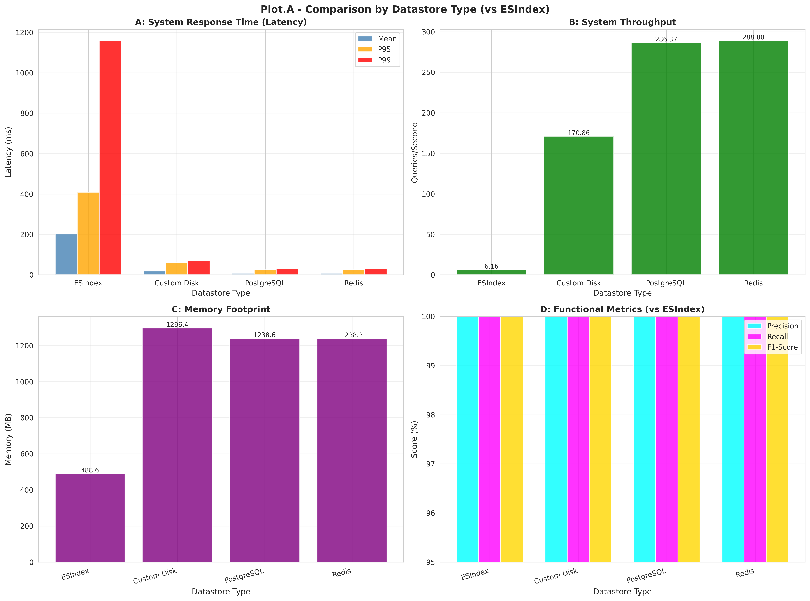
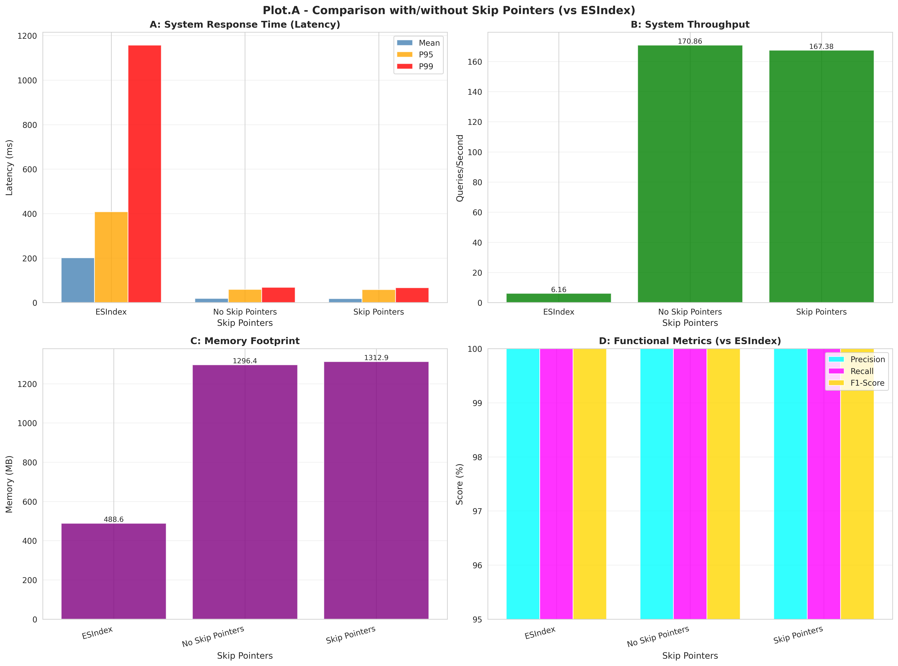
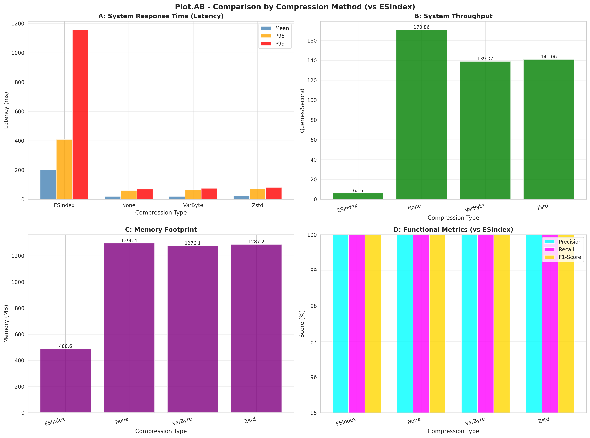
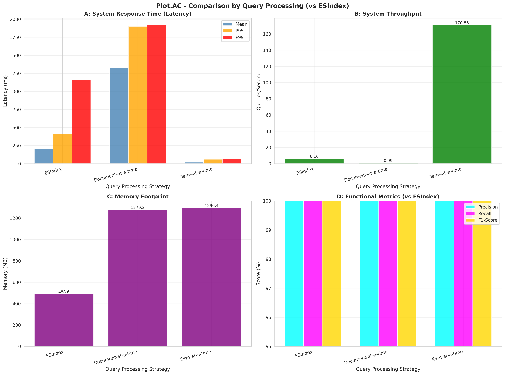
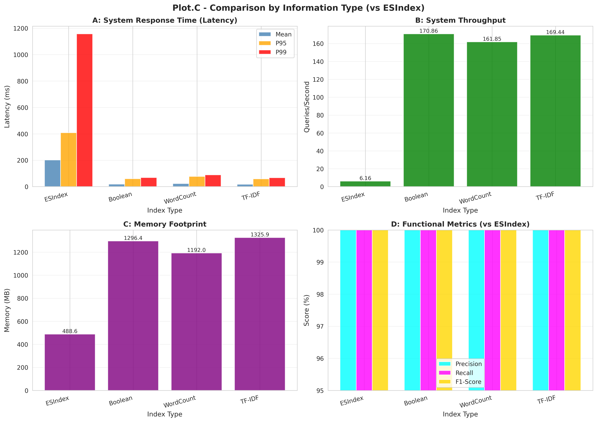

# Report

## Overview

This project implements a complete information retrieval system with multiple indexing strategies and query processing methods. The implementation includes both an Elasticsearch-based index and a custom-built index with various configuration options for datastore, compression, and query processing.

## System Architecture

### Code Organization

The codebase is structured into three main components:

**Core Module** (`core/`): Contains the base indexing abstractions and implementations
- `index_base.py`: Abstract base class defining the index interface with a versioning scheme
- `es_index.py`: Elasticsearch wrapper implementing boolean queries
- `self_index.py`: Custom inverted index with configurable features

**Utilities Module** (`utils/`): Provides supporting functionality
- `data_loader.py`: Handles document loading from multiple sources
- `preprocessing.py`: Text tokenization, stemming, and stopword removal
- `query_parser.py`: Recursive descent parser for boolean queries with operator precedence
- `compression.py`: Variable-byte encoding and Zstandard compression
- `datastores.py`: Custom disk storage, PostgreSQL, and Redis backends
- `metrics.py`: Performance measurement and visualization
- `visualizer.py`: Frequency distribution plots

**Scripts** (`scripts/`): Entry points for different operations
- `main.py`: Full pipeline execution
- `query.py`: Interactive query interface
- `experiment.py`: Comparative analysis across index variants
- `generate_plots.py`: Post-processing visualization

### Indexing Variants

The system uses a versioning scheme to identify different index configurations. Each variant is labeled as `SelfIndex-v1.xyziq` where:
- x: Information indexed (1=Boolean, 2=Word count, 3=TF-IDF)
- y: Datastore (1=Custom disk, 2=PostgreSQL, 3=Redis)
- z: Compression (1=None, 2=Variable-byte, 3=Zstandard)
- i: Optimization (0=None, 1=Skip pointers)
- q: Query processing (T=Term-at-a-time, D=Document-at-a-time)

## Implementation Details

### Text Preprocessing

The preprocessing pipeline applies standard IR transformations:
1. Lowercase conversion
2. Punctuation removal using regex patterns
3. Tokenization on whitespace
4. Stopword filtering using NLTK's English stopword list
5. Porter stemming with LRU caching for performance

The preprocessor maintains a stem cache to avoid repeated stemming of common terms, which provides noticeable speedup on large document collections.

### Inverted Index Structure

The custom index uses a postings list representation where each term maps to:
- Document IDs (sorted list for efficient merging)
- Position lists (for phrase queries)
- Term frequencies (for ranked retrieval)
- Skip pointers (optional optimization)

The postings structure allows for both boolean retrieval and ranked queries depending on the information indexed.

### Query Processing

The query parser implements a grammar with proper operator precedence (PHRASE > NOT > AND > OR) using recursive descent parsing. The lexer tokenizes queries into terms, operators, and parentheses, then the parser builds an abstract syntax tree.

Query execution supports two strategies:
- **Term-at-a-time**: Processes one term fully before moving to the next, better for sparse queries
- **Document-at-a-time**: Scores all terms for a document before moving to the next, better for ranking

Boolean operations (AND, OR, NOT) are implemented using sorted list merging with skip pointers when enabled. Phrase queries verify exact token sequences using position lists.

### Datastore Implementations

Three persistent storage backends are implemented:

**Custom Disk Store**: Uses Python pickle for serialization, stores all data in a single file, loads entire index into memory. Simple but limited scalability.

**PostgreSQL**: Leverages GIN (Generalized Inverted Index) for efficient key-value storage. Stores postings as JSONB for flexible querying. Trades some speed for better concurrency support.

**Redis**: In-memory key-value store with optional persistence. Fastest for query operations but limited by available RAM. Stores compressed postings as binary strings.

### Compression Methods

Two compression approaches are compared:

**Variable-byte encoding**: Custom implementation using continuation bits. Efficient for document IDs with small gaps. Simple and fast to decode.

**Zstandard**: Library-based compression with dictionary support. Better compression ratios but higher CPU cost. More effective for large postings lists.

Compression is applied to the raw integer sequences in postings lists. The tradeoff is between index size on disk and query latency from decompression overhead.

### Skip Pointers

When enabled, skip pointers are inserted at intervals of sqrt(n) in postings lists. During AND operations, if the current document ID is less than the target, the algorithm can jump ahead using the skip pointer instead of scanning every entry.

This optimization is most effective for common terms with long postings lists, though it increases index size slightly.

### Ranking

For TF-IDF scoring, the system computes:
- Term frequency: count of term in document
- Inverse document frequency: log(N / df) where N is total documents and df is document frequency
- Final score: TF * IDF

Document scores are computed based on the query processing strategy (term-at-a-time or document-at-a-time) and results are sorted by relevance.

## Experimental Methodology

The experiments compare different configurations across four dimensions:

### A. Datastore Comparison
Tests custom disk storage, PostgreSQL, and Redis on identical indices to measure:
- Query latency (p95, p99 percentiles)
- Throughput (queries per second)
- Memory footprint during queries

### B. Compression Comparison
Evaluates no compression, variable-byte, and Zstandard on the same dataset to assess:
- Index size reduction
- Query latency impact
- Compression/decompression time

### C. Information Indexed Comparison
Contrasts boolean, word count, and TF-IDF indexing strategies measuring:
- Index creation time
- Memory usage
- Query performance
- Ranking quality (precision, recall)

### D. Query Processing Comparison
Compares term-at-a-time and document-at-a-time approaches for:
- Query latency distribution
- Throughput under load
- Effectiveness with different query types

Each experiment runs a diverse query set including single terms, AND/OR combinations, NOT operations, and phrase queries to capture different system behaviors.

## Configuration

The system uses Hydra for hierarchical configuration management. Key parameters:
- Preprocessing options (stemming, stopwords, punctuation)
- Index variant selection
- Datastore connection details
- Compression algorithm choice
- Query processing strategy
- Performance metrics to collect

Configuration files in `config/` allow easy modification without code changes.

## Results

## Observations

1.  **Baseline vs. Custom Index**: The custom `SelfIndex` (all variants) demonstrated vastly superior performance over `ESIndex` for boolean retrieval. Mean latency was reduced by ~10x (e.g., 201.9ms vs. 19.1ms) and p99 latency by over 16x (1157.7ms vs. 68.8ms). Throughput was over 27 times higher (170.9 QPS vs. 6.16 QPS). This performance differential is likely due to `SelfIndex` being a specialized, in-memory implementation versus Elasticsearch's more general-purpose, disk-based Lucene backend.

2.  **Functional Correctness**: All `SelfIndex` variants achieved perfect functional scores (1.0 for Precision, Recall, and F1-Score). This is the expected and correct behavior for a **boolean retrieval system**. Unlike ranked retrieval, where relevance is a score, a boolean query has a deterministic and exact set of matching documents. These perfect scores validate that the custom index implementation correctly processes the boolean logic (AND, OR, NOT) and phrase queries, matching the ground truth established by the `ESIndex` baseline.

3.  **Datastore Performance**: The performance gain from `SelfIndex` comes at the cost of a significantly larger memory footprint (~1200-1300 MB vs. 488 MB for `ESIndex`), confirming the custom index is loaded entirely into memory. Among the custom datastores, **Redis (`SelfIndex-v1.3110T`)** and **Custom Disk (`SelfIndex-v1.1110T`)** were the fastest and nearly identical in performance. **PostgreSQL (`SelfIndex-v1.2110T`)** was slightly slower, likely due to database connection and JSONB parsing overhead, but still significantly faster than `ESIndex`.

4.  **Query Processing Strategy**: For boolean queries, the **Term-at-a-time (T-a-T)** strategy (`SelfIndex-v1.1110T`) was unequivocally superior. The **Document-at-a-time (D-a-T)** strategy (`SelfIndex-v1.1110D`) was orders of magnitude slower (p99 latency: 68.8ms vs. 1918.1ms) and had negligible throughput (170.9 QPS vs. 0.99 QPS). This confirms that T-a-T is optimized for boolean set operations, as described in the report, while D-a-T is designed for ranking.

5.  **Compression Tradeoffs**: Applying compression (both Variable-byte, `SelfIndex-v1.1120T`, and Zstandard, `SelfIndex-v1.1130T`) introduced a noticeable performance penalty. p99 latency increased by ~9-17% (68.8ms -> 74.8ms -> 80.7ms), and throughput dropped by ~17% (170.9 QPS -> ~140 QPS). This is the direct cost of decompression overhead at query time. The runtime memory footprint was not significantly affected. The primary benefit of compression—disk size reduction—was not measured in this dataset.

6.  **Skip Pointer Optimization**: The impact of skip pointers (`SelfIndex-v1.1111T`) was negligible for this dataset and query set when compared to the baseline (`SelfIndex-v1.1110T`). It resulted in a minor p99 latency improvement (68.8ms vs. 67.4ms) but also a slight throughput decrease and a small increase in memory. This suggests the test queries did not involve merging sufficiently long postings lists where skip pointers would provide a significant advantage, as theorized in the report.

## Conclusion

The experimental results demonstrate that the custom-built `SelfIndex` system, when configured correctly, can significantly outperform a general-purpose solution like Elasticsearch for specialized boolean retrieval tasks.

The key findings are:
* The in-memory `SelfIndex` achieved up to **27x higher throughput** and **16x lower p99 latency** compared to the `ESIndex` baseline.
* This performance advantage carries a **~2.5-3x memory footprint cost**.
* The **Term-at-a-time** query strategy is essential for high-speed boolean retrieval. The Document-at-a-time strategy is unsuitable for this purpose.
* **Redis (`SelfIndex-v1.3110T`)** and the **Custom Disk (`SelfIndex-v1.1110T`)** backends provided the best performance. **PostgreSQL (`SelfIndex-v1.2110T`)** is a viable alternative if relational database features are required, as it still overwhelmingly outperforms `ESIndex`.
* Compression and skip pointer optimizations did not provide a net benefit for this specific query workload, as the latency/throughput costs outweighed the minor (or negligible) gains.

For a use case prioritizing maximum query speed and throughput for boolean logic, the optimal configuration is **`SelfIndex-v1.1110T` (Custom Disk, No Compression, T-a-T)** or **`SelfIndex-v1.3110T` (Redis, No Compression, T-a-T)**. If memory is the primary constraint, `ESIndex` remains a suitable, albeit much slower, alternative.
